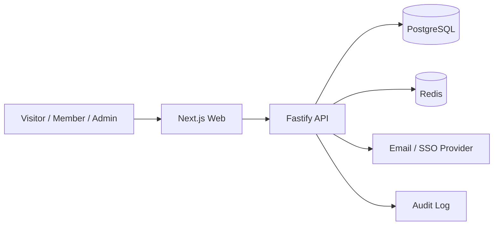

# 03. 架构设计

## 总体架构



## 应用边界

### `apps/web`

负责：

- 页面渲染
- 视觉系统
- 表单提交
- 状态展示
- 管理员操作界面

### `apps/api`

负责：

- REST API
- 认证与授权
- 邀请申请和审核
- 资源、课程、制度读取
- 审计日志

### `packages/shared`

负责：

- 共享 schema
- 共享类型
- RBAC 常量
- 业务枚举

### `packages/db`

负责：

- Prisma schema
- seed 数据
- 数据库 client

## 部署建议

```text
Web       -> Vercel / Node server / school intranet host
API       -> Docker container / Kubernetes / VM
Postgres  -> Managed PostgreSQL or school-hosted PostgreSQL
Redis     -> Managed Redis or internal cache
Storage   -> Object storage for future documents/assets
```

## 模块划分

- Invitation Module
- Application Review Module
- Resource Module
- Course Module
- Policy Module
- Member Module
- Audit Module
- RBAC Module
